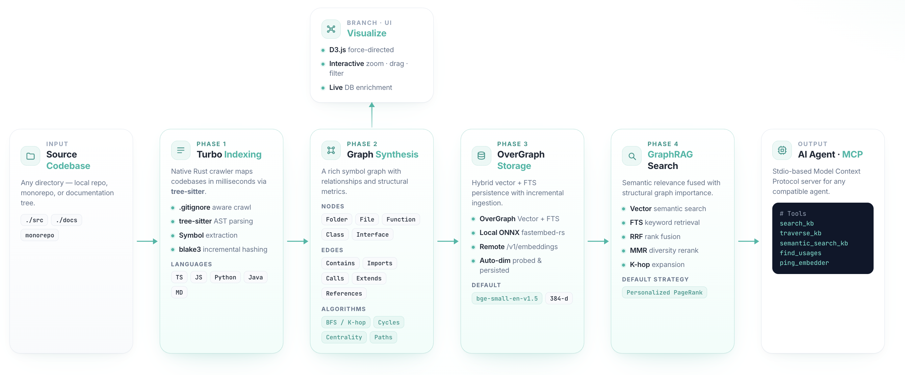

# UltraGraph: High-Performance Knowledge Graph & RAG Engine

A high-performance, local-first knowledge base engine that transforms codebases and documents into an interactive, visualized, and queryable **Semantic Knowledge Graph**. Built with Rust and Node.js for maximum speed and flexibility.

## ⚡ Overview

- **UltraGraph Introduction**: [https://ultra-graph.web.app](https://ultra-graph.web.app)

### 🎬 Demo

[](https://youtu.be/d4OgINrD27Y)

> Click the thumbnail to watch the walkthrough on YouTube.

UltraGraph implements a complete four-phase pipeline for building and querying advanced knowledge bases:

- **Phase 1: Turbo Indexing** — Native multi-threaded indexer that maps codebases in milliseconds using `tree-sitter`.
- **Phase 2: Graph Synthesis** — Builds a rich symbol graph with structural analysis (centrality, cycle detection, shortest paths).
- **Phase 3: OverGraph Storage** — Persistent vector + FTS storage with incremental ingestion and **in-process ONNX embedding** out of the box.
- **Phase 4: GraphRAG Search** — State-of-the-art retrieval using **Personalized PageRank (PPR)** to combine semantic relevance with structural importance.

---

## 🏗️ Architecture

[](https://ultra-graph.web.app/architecture.html)

> Click the diagram for an interactive view at [ultra-graph.web.app/architecture.html](https://ultra-graph.web.app/architecture.html).

---

## ✨ Features

| Category | Feature | Status |
| :--- | :--- | :--- |
| **Indexing** | Parallel multi-core file crawling (`.gitignore` aware) | ✅ |
| | Languages: **TypeScript, JavaScript, Python, Java, Rust, Markdown, PDF** | ✅ |
| | Incremental indexing with `blake3` hashing | ✅ |
| **Graph** | Folder hierarchy extraction & classification | ✅ |
| | Symbol extraction (Functions, Classes, Interfaces, Imports, Calls) | ✅ |
| | K-hop BFS, Shortest Path, Centrality, Cycle Detection | ✅ |
| **Storage** | **OverGraph**: Hybrid Vector + FTS storage | ✅ |
| | **Local ONNX embedding** via `fastembed-rs` (in-process, no service needed) | ✅ |
| | Optional remote OpenAI-compatible `/v1/embeddings` backend | ✅ |
| | Auto-probed embedding dim; persisted to `<db>/ug-meta.json` | ✅ |
| **Retrieval** | **GraphRAG**: Personalized PageRank (PPR) & MMR strategies | ✅ |
| | RRF (Reciprocal Rank Fusion) for hybrid search | ✅ |
| **Chat** | **`ug chat`**: RAG-grounded chat against any OpenAI-compatible LLM | ✅ |
| | One-shot + interactive REPL; per-turn citations; `--json` output | ✅ |
| | **`POST /api/chat`** in `ug serve` powers the web chat panel | ✅ |
| **Interface** | **Web UI**: Premium D3.js force-directed visualization | ✅ |
| | **Web Chat panel**: drop-in UI over `/api/chat` with citation jumps | ✅ |
| | **MCP Server**: Stdio-based server for LLM integration | ✅ |
| | **CLI**: Comprehensive toolkit for all phases | ✅ |

---

## 🚀 Quick Start

### 1. Prerequisites
- **Rust** (latest stable)
- **Node.js** 20+
- **No external embedding service required.** UltraGraph ships with an in-process **ONNX embedder** powered by [`fastembed-rs`](https://github.com/Anush008/fastembed-rs). Model weights are downloaded once on first use (~22–130 MB depending on model) and cached locally. Pass `--base-url` if you want to route to a remote OpenAI-compatible endpoint instead.

### 2. Build the Project
```bash
npm run build
```

### 3. Generate Your First Graph
The `gen` command runs the entire pipeline (index → graph → ingest → UI).
```bash
# Run the full pipeline on the current directory
npm run gen -- -i ./ -o .ug --no-ingest
```

### 4. Visualize
Open the interactive visualization in your browser:
```bash
npm start
# Visit http://localhost:8080
```

---

## 🛠️ Command Line Interface

UltraGraph provides a powerful CLI via `node node/cli.cjs` (or the native `ug` binary).

### Common Commands

| Command | Usage | Description |
| :--- | :--- | :--- |
| `gen` | `npm run gen -- [options]` | Full pipeline: Index + Graph + Ingest + UI |
| `index` | `npm run index -- -i <dir>` | Extract symbols from a directory |
| `graph` | `npm run graph -- -i <index.json>` | Build structural graph from index |
| `ingest` | `npm run ingest -- -i <graph.json>` | Embed and store in OverGraph |
| `rag` | `npm run rag -- <db> <query>` | Perform a GraphRAG retrieval |
| `traverse`| `npm run traverse -- <db> <id>` | K-hop traversal over stored edges |
| `chat`    | `ug chat "<question>" -d <db> --chat-model <model> ...` | RAG-grounded chat (one-shot or REPL) against an LLM |

### Advanced GraphRAG Options
When using `rag` or `db-rag`, you can tune the retrieval strategy:
- `--strategy ppr`: (Default) Uses Personalized PageRank seeded by semantic hits.
- `--strategy mmr`: Uses legacy seed-expansion with Maximal Marginal Relevance.
- `--restart-prob 0.15`: Teleport probability for PPR (higher = stays closer to seeds).
- `--direction outbound`: Restrict graph walk direction.

---

## 🧠 Embeddings

UltraGraph picks a backend based on a single flag: **omit `--base-url` for the local in-process embedder (default), or pass `--base-url` to use a remote OpenAI-compatible endpoint.** The same flags apply to `ingest`, `gen`, `rag`, and `semantic_search`.

### Local backend (default) — in-process ONNX via `fastembed-rs`

No daemon, no Docker, no network. The first call downloads the ONNX weights into a user cache directory; every subsequent run loads from disk. Inference runs on CPU through the ORT runtime and is dispatched onto a blocking pool so it doesn't stall the async runtime.

```bash
# Default — bge-small-en-v1.5, 384-dim, ~130 MB on first run
ug ingest -i .ug/graph.json -o .ug/ugdb

# Pick a different model by alias
ug ingest --model nomic-embed-text-v1.5     # 768-dim, long-context
ug ingest --model jina-embeddings-v2-base-code   # 768-dim, code-aware
ug ingest --model mxbai-embed-large-v1      # 1024-dim, top-tier quality
```

**Supported aliases** (case-insensitive; vendor prefix optional):

| Alias | Dim | Notes |
| :--- | :--- | :--- |
| `bge-small-en-v1.5` *(default)* | 384 | Smallest viable, fastest |
| `bge-base-en-v1.5` | 768 | Balanced |
| `bge-large-en-v1.5` | 1024 | Highest quality in BGE family |
| `all-MiniLM-L6-v2` / `all-MiniLM-L12-v2` | 384 | Sentence-Transformers classics |
| `nomic-embed-text-v1.5` | 768 | Strong on long context |
| `multilingual-e5-small` / `base` / `large` | 384 / 768 / 1024 | Multilingual |
| `bge-small-zh-v1.5` | 512 | Chinese-heavy docs |
| `jina-embeddings-v2-base-code` | 768 | Code-aware |
| `mxbai-embed-large-v1` | 1024 | Top-tier quality |

**Model cache resolution order:**
1. `UG_MODEL_CACHE` env var (full path) — ops escape hatch.
2. `XDG_CACHE_HOME/ug/models` — Linux convention.
3. Platform default — `~/Library/Caches/ug/models` (macOS), `~/.cache/ug/models` (Linux), `%LOCALAPPDATA%\ug\models` (Windows).

### Remote backend (opt-in) — OpenAI-compatible `/v1/embeddings`

Passing `--base-url` switches to the HTTP client. Works with OpenAI, [Ollama](https://ollama.ai/), `text-embeddings-inference`, vLLM, or any service exposing the OpenAI embeddings shape.

```bash
ug ingest \
  --base-url https://api.openai.com/v1 \
  --api-key  $OPENAI_API_KEY \
  --model    text-embedding-3-small
```

### Dimension handling

You don't need to know your model's dim. On first ingest, UltraGraph runs a one-shot probe, writes the discovered dim to `<db>/ug-meta.json`, and reuses it on every subsequent open. Override explicitly with `--embedding-dim <n>` if you need to pin it.

---

## 💬 RAG Chat (`ug chat`)

`ug chat` closes the loop: it retrieves graph-aware context via the same
GraphRAG pipeline that `hybrid_search` uses, then sends it to an
OpenAI-compatible chat model and prints the answer. Use it to verify
the *quality* of the indexed knowledge base end-to-end — not just that
retrieval works, but that a real LLM agent can actually answer
questions grounded in it.

### One-shot

```bash
ug chat "how does graph ingest work?" \
  -d .ug/ugdb \
  --base-url http://127.0.0.1:8000/v1 \
  --api-key  12345 \
  --chat-model      Qwen3.6-35B-A3B-MLX-8bit \
  --embedding-model Qwen3-Embedding-4B-4bit-DWQ \
  --show-context
```

The answer is printed to stdout. Add `--json` to emit a single JSON
document containing the answer, citations, retrieval / completion
latencies and (when the server reports it) token usage — handy for
scripted regression testing.

### Interactive REPL

Omit the prompt to drop into a REPL with a 6-turn rolling history:

```bash
ug chat -d .ug/ugdb \
  --base-url http://127.0.0.1:8000/v1 \
  --chat-model my-chat-model
# you ❯ how does ingest work?
# Answer:
#   ...
# you ❯ /reset    # clear history
# you ❯ /context on   # show retrieved [#1], [#2], ...
# you ❯ /quit
```

### Key flags

| Flag | Description |
| :--- | :--- |
| `-d, --db <path>`            | OverGraph directory (default: `.ug/ugdb`) |
| `--chat-model <name>`        | Chat completion model (required for remote chat) |
| `--base-url <url>`           | OpenAI-compatible base URL (shared with embeddings) |
| `--api-key <key>`            | Bearer token (shared with embeddings) |
| `--chat-base-url` / `--chat-api-key` | Override the chat endpoint only |
| `--embedding-model <name>`   | Embedding model (falls back to `--model`) |
| `--embedding-base-url` / `--embedding-api-key` | Override the embedding endpoint only |
| `-k, --limit <n>`            | Retrieved context items (default: 8) |
| `--hops <n>`                 | Graph expansion hops (default: 2) |
| `--strategy ppr\|mmr`        | Reranker (default: `ppr`) |
| `--max-chars <n>`            | Context char budget (default: 12000) |
| `--temperature <f>`          | Sampling temperature (default: 0.2) |
| `--max-tokens <n>`           | Max completion tokens (default: 1024) |
| `--system <text>`            | Override the default RAG system prompt |
| `--show-context, -v`         | Print retrieved citations alongside the answer |
| `--json`                     | Emit JSON for scripted use |

### Chat over HTTP (`POST /api/chat`)

`ug serve` exposes the same pipeline at `POST /api/chat`. Start the
server with chat enabled:

```bash
ug serve -i .ug/graph.json -d .ug/ugdb \
  --base-url http://127.0.0.1:8000/v1 --api-key 12345 \
  --chat-model Qwen3.6-35B-A3B-MLX-8bit
```

Then either use the built-in **Chat** panel in the web UI
(`http://127.0.0.1:8080`) — which surfaces clickable citations that
jump to the corresponding graph node — or call the API directly:

```bash
curl -s http://127.0.0.1:8080/api/chat \
  -H 'Content-Type: application/json' \
  -d '{
        "query": "explain the PPR seed pool logic",
        "k": 8,
        "hops": 2,
        "history": []
      }' | jq
```

Per-request overrides supported in the body: `chat_model`,
`chat_base_url`, `chat_api_key`, `temperature`, `max_tokens`,
`system_prompt`, `dest`, `edge_types`, `strategy`, `direction`,
`include_snippets`, `max_context_chars`, `where`.

`GET /api/capabilities` reports `chat_ready` plus the current
`chat.model` / `chat.base_url` so clients can disable their chat UI
gracefully when chat isn't configured.

---

## 🤖 MCP Server

Integrate UltraGraph directly into your AI Agent (Cursor, Claude Desktop, etc.).

### Tools Exposed
1.  **search_kb**: Graph-based RAG retrieval (PPR-based).
2.  **traverse_kb**: Structural walk from specific node IDs.
3.  **ping_embedder**: Verify embedding connectivity.

### Configuration
Set these environment variables before starting the server:
- `UG_DB_PATH`: Path to your OverGraph directory (default: `./.ug/ugdb`).
- `UG_REPO_ROOT`: Root path for resolving snippet file paths.
- `UG_EMBED_MODEL`: Override embedding model (local fastembed alias or remote model name).
- `UG_EMBED_BASE_URL`: **Set this to opt into the remote backend.** When unset, the MCP server uses the in-process ONNX embedder.
- `UG_EMBED_API_KEY`: Bearer token for the remote endpoint.
- `UG_MODEL_CACHE`: Override the local ONNX model cache directory.

```bash
UG_DB_PATH=./.ug/ugdb 

{
  "mcpServers": {
    "ultragraph": {
      "command": "node",
      "args": ["/Users/aldrickwan/Documents/project/ug/.ug/mcp-server.mjs"],
      "env": {
        "UG_DB_PATH": "/Users/aldrickwan/Documents/project/ug/.ug/ugdb"
      }
    }
  }
}

```

---

## 🔌 Native API Usage

You can use the high-performance Rust core directly in your own Node.js apps via the `native/index.js` loader.

```javascript
const { index, buildGraph, dbHybridSearch } = require('./native/index.js');

// Index a codebase
const symbols = index('./src');

// Search with GraphRAG
const context = await dbHybridSearch('./ugdb', JSON.stringify({
  query: "how does authentication work?",
  k: 10
}));
```

---

## 🧪 Testing

```bash
# Run JS test suite
npm test

# Run Native Rust tests
npm run build && cd native && cargo test
```

## 📄 License
MIT
