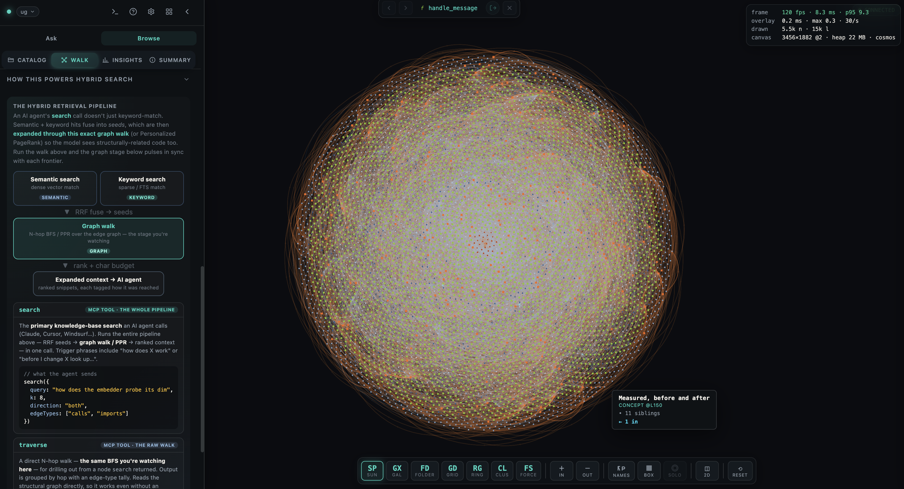
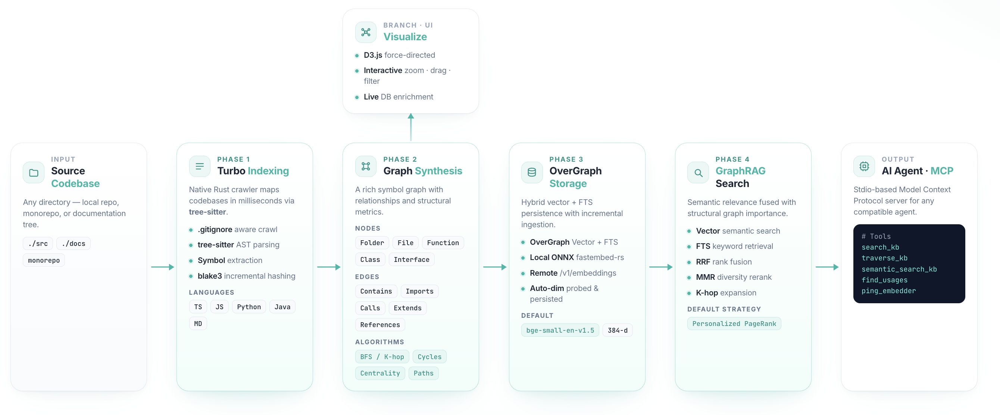

# UltraGraph: High-Performance Knowledge Graph & RAG Engine

A local-first engine that turns codebases and documents into an interactive,
queryable **Semantic Knowledge Graph**. Built with Rust and Node.js for speed.

- **Intro**: [ultra-graph.web.app](https://ultra-graph.web.app)
- **Demo**: [Click to watch demo video](https://youtu.be/9Je4T8h1YX8)

[](https://youtu.be/9Je4T8h1YX8)

## Install

```bash
curl -fsSL https://ultra-graph.web.app/install.sh | sh
```

Installs the `ug` binary (and the `ug-app` desktop shell) to
`~/.local/share/ultragraph/.ug/` and symlinks `ug` onto `~/.local/bin`.
Windows: download `ultragraph-windows-x64.zip` from
[Releases](https://github.com/shoocstorm/ug/releases/latest). Build from source
with **Rust** (latest stable): `cd native && cargo build --release`.

`ug upgrade` self-updates (`--check` reports whether a release is available).

## Quick Start

```bash
ug gen        # index → graph → ingest this repo (→ ~/.ug/<name>/)
ug            # bare `ug` == `ug serve`: visualization + REST API at :8080
```

- **`ug gen`** runs the full pipeline on the current directory. Output goes to
  `~/.ug/<project-name>/` (name = directory basename; override with `-n/--name`).
  Add `--no-embed` to write the database without vectors (no embedding model is
  loaded — much faster; only `search`/`semantic_search`/`chat` lag), or
  `--no-ingest` to skip the database entirely (`ug analyze` statistics and blast
  radius lag too). See [`--no-embed` vs `--no-ingest`](#--no-embed-vs---no-ingest).
- **`ug serve`** (or bare `ug`) without `-i` runs in **multi-project mode**:
  discovers every project under `~/.ug` and adds a UI project switcher. With zero
  projects it shows the KB Manager wizard instead of erroring — so `ug` alone is
  always safe to run first.

```bash
ug gen -i ~/code/other-repo -n other --no-embed   # index another repo, no vectors yet
```

`ug -h` lists every command; `ug <command> -h` prints its full flags. From a
source build, the binary is `native/target/release/ug`.

No external embedding service is required: UltraGraph ships an in-process
**ONNX embedder** ([`fastembed-rs`](https://github.com/Anush008/fastembed-rs)).
Weights download once on first use (~22–130 MB) and cache locally. Pass
`--base-url` for a remote OpenAI-compatible endpoint instead — see
[Embeddings](#embeddings).

## Architecture

[](https://ultra-graph.web.app/architecture.html)

A four-phase pipeline (click the diagram for an
[interactive view](https://ultra-graph.web.app/architecture.html)):

1. **Turbo Indexing** — native multi-threaded `tree-sitter` indexer, incremental via `blake3` hashing.
2. **Graph Synthesis** — symbol graph with structural analysis (centrality, cycles, shortest paths).
3. **OverGraph Storage** — persistent vector + FTS store with in-process ONNX embedding.
4. **GraphRAG Search** — Personalized PageRank (PPR) fusing semantic relevance with structural importance.

## Features

| Category | Feature |
| :--- | :--- |
| **Indexing** | Parallel `.gitignore`-aware crawling; incremental `blake3` hashing |
| | Languages: **TypeScript, JavaScript, Python, Java, Rust, Markdown, PDF** |
| **Graph** | Folder hierarchy + symbol extraction (Functions, Classes, Interfaces, Imports, Calls) |
| | **Cross-file call resolution** for Rust, TypeScript, Python and Java — module paths and receiver types, not name matching. Ambiguous call sites are dropped rather than guessed at ([how](docs/INDEXING-AND-CHUNKING.md#31a-cross-file-call-resolution)) |
| | K-hop BFS, Shortest Path, Centrality, Cycle Detection |
| **Storage** | **OverGraph**: hybrid Vector + FTS store; local ONNX or remote OpenAI-compatible embedding |
| **Retrieval** | **GraphRAG**: PPR ranking over the edge graph; RRF hybrid fusion |
| **Chat** | `ug chat` + `POST /api/chat`: RAG-grounded chat against any OpenAI-compatible LLM, with citations |
| **Interface** | Web UI (D3.js viz + chat panel), `ug app` desktop shell (Tauri), MCP server, CLI |

## Data layout

All generated data lives in one folder per project under `~/.ug` (override the
root with `UG_HOME`):

```
~/.ug/<project-name>/
├── graph.json          # the knowledge graph
├── indexed-tree.json   # raw symbol tree
├── ugdb/               # OverGraph vector + edge store
├── project.json        # name, repoRoot, node/edge counts, timestamps
└── README.md
```

`ug list` shows every project with counts and last-generated times; `ug rename
<new-name>` renames one (the active project by default — the graph and db move
with it); `ug rm <project>` deletes one (prompts unless `-f/--force`/`-y/--yes`).
The repo-local `.ug/` folder only holds the `ug` binary, not data.

## Command Line Interface

The native `ug` binary is the primary CLI. `ug -h` lists every command;
`ug <command> -h` prints that command's full flags and examples.

| Command | Description |
| :--- | :--- |
| `ug gen` | Full pipeline: index → graph → visualization → OverGraph ingest. With no path named, re-runs an already-generated project from its recorded repo root — incremental. |
| `ug update <file>...` | Refresh the graph for just the files you changed — the focused counterpart to `gen`, built for a live editing session |
| `ug hook install` | Hang that refresh off git: hooks on commit, merge, checkout and rebase re-index the paths each event touched, so blast-radius answers never lag the working tree. Hook runs pass `--no-embed` — no embedding model is loaded, which is most of the run time — so vectors alone lag; `ug hook status` says how far and `ug ingest -n <project>` backfills them. `ug hook uninstall`; `UG_HOOK_DISABLE=1` skips one command. |
| `ug serve` / `ug app` | Serve the viz + REST API (multi-project); `app` wraps it in a native Tauri window |
| `ug index` / `graph` / `ingest` | The individual pipeline stages `gen` runs for you. Unlisted in `ug -h` — `gen --no-ingest` covers the usual reason to want one. |
| `ug search "<query>"` | GraphRAG: semantic search → graph expansion → ranked context |
| `ug semantic_search "<query>"` | Plain vector search, no graph expansion |
| `ug traverse <node-id>` | K-hop BFS over the stored OverGraph edges |
| `ug chat "<question>"` | RAG-grounded chat against an LLM — see [docs/CHAT.md](docs/CHAT.md) |
| `ug project_overview` / `find_symbols` / `file_outline` / `get_code` / `find_usages` / `shortest_path` / `graph_schema` | Agent tools — same names, params and output as the MCP tools and `POST /api/tools/<name>`. Add `--json` for the machine-readable envelope. |
| `ug find_symbols 'handle_*'` · `ug file_outline 'src/**/*.ts'` · `ug find_usages 'validate_*'` | Wildcards (`*` `?` `[abc]` `{a,b}`) work anywhere a symbol or file is named — one call instead of a loop. Those commands also take a plain symbol name, not just a node id. See [docs/API-REFERENCE.md](docs/API-REFERENCE.md#wildcards). |
| `ug analyze <preset>` | Whole-repo statistics: "how many functions over 50 lines", "what breaks if I change this file", "which endpoints a change is visible through", "which folders are worst documented". `ug analyze --list` shows every preset; `--gql` runs a raw query. |
| `ug list` / `ug rename <new>` / `ug rm <project>` | List projects under `~/.ug`, rename one (the active one by default), or delete one |
| `ug doctor` | Print resolved project/db/embedder/chat config and where each value came from |
| `ug connect [agent]` | Connect an AI agent — CLI skill, MCP server, or both. See [Connecting an AI agent](#connecting-an-ai-agent) |
| `ug config ...` | Persist defaults — see [Configuration](#configuration) |
| `ug upgrade` / `ug uninstall` | Self-update from GitHub, or remove all projects + the install (prebuilt only) |

Every command that selects a project takes `-n/--name <project>` (default: cwd
basename, else the most recently generated project under `~/.ug`). Destructive
commands (`rm`, `uninstall`) prompt unless `-f/--force`/`-y/--yes` is given.

### Which storage backs what

Two stores exist per project under `~/.ug/<name>/`: **`graph.json`** (structural,
written by `ug graph`) and **`ugdb/`** (the OverGraph vector+edge store, written
by `ug ingest`). Which one a command reads tells you what still works after
`ug gen --no-ingest`, or when no embedding backend is reachable.

| Reads | Works |
| :--- | :--- |
| **`graph.json`** — no DB or embedder needed | `find_symbols`, `file_outline`, `get_code`, `find_usages`, `traverse`, `shortest_path`, `project_overview`, `graph_schema`, all `graph_*` tools; `GET /api/graph/*`, `/api/file`, `/graph.json` |
| **`ugdb/`** — needs the ingest step, but **no embedder** | `analyze` (statistics); `traverse --dest <name>`; `GET /api/db/node/:id`, `/api/db/traverse/:id`, `POST /api/tools/analyze` |
| **`ugdb/` + an embedder** — needs ingest *and* a reachable backend | `search`, `semantic_search`, `chat`; `POST /api/search/hybrid`, `/api/search/semantic`, `/api/chat` |

The practical consequence: **only `search`, `semantic_search` and `chat` need an
embedder — but `ug analyze` still needs the database.** If your embedding endpoint
is down, symbol lookup, outlines, source reads, usage analysis, traversal,
pathfinding *and* whole-repo statistics all still work. `--dest <name>` (or
`/api/db/traverse`) runs `traverse` against a destination store, to verify what
landed in OverGraph or Neo4j — see
[docs/MULTI-STORAGE-DEST.md](docs/MULTI-STORAGE-DEST.md).

### `--no-embed` vs `--no-ingest`

Both are accepted by `ug gen` and `ug update`, and they are not the
same thing. The row above tells you why the difference matters: `ug analyze` —
statistics, `diff_impact`, blast radius — needs `ugdb/`, but not an embedder.

| Flag | Written to `ugdb/` | Current after the run | Answering from the *previous* ingest |
| :--- | :--- | :--- | :--- |
| `--no-embed` | nodes, edges, facts, keyword statistics — **everything but the vectors**. No embedding model is loaded, which is most of a small run's wall clock. | the `graph.json` tools **and `ug analyze`** | `search`, `semantic_search`, `chat` |
| `--no-ingest` | **nothing** — the database is never opened; only `graph.json` is rebuilt. | the `graph.json` tools only | **everything `ugdb/` backs**, including `ug analyze` |

`ug ingest -n <project>` catches the database up either way — it embeds only the
nodes still owed a vector. This is why the git hooks use `--no-embed`: blast
radius stays exact while the vectors arrive on your schedule.

## Configuration

Persist defaults once instead of repeating flags on every invocation:

```bash
ug config set chat.model gpt-4o-mini
ug config set chat.base_url https://api.openai.com/v1
ug config set embed.model text-embedding-3-small
ug config list          # every key, its value, and what can override it
```

Values land in `$UG_HOME/config.json`. Precedence is always **CLI flag > env
var > `ug config` > built-in default**; a `.env` file in the cwd supplies
per-repo env-var defaults. Run `ug doctor` to see which tier won for each
setting. Full key list, the env-var table, and `.env` details are in
[docs/CONFIGURATION.md](docs/CONFIGURATION.md).

## Embeddings

Pick a backend with a single flag on `ingest`/`gen`/`semantic_search`/`search`:
**omit `--base-url` for the local in-process ONNX embedder (default), or pass
`--base-url` for a remote OpenAI-compatible endpoint.**

```bash
ug ingest                                   # local default: bge-small-en-v1.5, 384-dim
ug ingest --model mxbai-embed-large-v1      # a different local alias (1024-dim)
ug ingest --base-url https://api.openai.com/v1 --api-key $OPENAI_API_KEY \
          --model text-embedding-3-small    # remote
```

You don't need to know your model's dim — it's probed on first ingest and
persisted to `<db>/ug-meta.json`. The full model-alias catalog, cache locations,
and backend architecture are in
[docs/EMBEDDING-BACKENDS.md](docs/EMBEDDING-BACKENDS.md).

## RAG Chat (`ug chat`)

`ug chat` retrieves graph-aware context via the same GraphRAG pipeline `search`
uses, then sends it to an OpenAI-compatible chat model and prints the answer
(one-shot, or a REPL if you omit the prompt). `ug serve` exposes the same
pipeline at `POST /api/chat`, which powers the web UI's Chat panel.

```bash
ug chat "how does graph ingest work?" \
  --base-url http://127.0.0.1:8000/v1 --api-key 12345 \
  --chat-model Qwen3.6-35B-A3B-MLX-8bit --show-context
```

Flags, the REPL commands, `--json` output, and the HTTP API are documented in
[docs/CHAT.md](docs/CHAT.md).

## Connecting an AI agent

An agent can reach UltraGraph two ways, and they are alternatives:

- **The `ug` CLI (recommended)** — install the agent skill and the agent runs
  `ug` itself. `ug --help` and `ug analyze --list` teach it the rest, so its
  knowledge stays current with the binary and costs no idle context.
- **The MCP server** — the agent calls tools over the protocol.

`ug connect [agent]` sets up either (or both) — an interactive picker when
no target, else one of: `claude`, `claude-desk`, `cursor`, `windsurf`, `vscode`,
`gemini`, `codex`, `hermes`, `opencode`. It asks which way you want, or take
`--cli` / `--mcp` / `--both`; `--project`/`--global` picks the scope.

Installing both leaves the agent to choose, and it tends to reach for the
connected tools — so if you want the CLI path, `--cli` is the way to get it.
Whichever you pick, the other is removed.

Add `--hooks` (or run `ug hook install` any time) to install the git hooks that
re-index after every commit, merge, checkout and rebase. An agent that edits
will not think to refresh the graph, and a stale graph is worst exactly where it
matters most — the blast-radius answer it asked for *because* it just edited.
Letting git trigger the refresh removes that from anyone's memory.

### For the agent, this is an edit-safety net — not just a search tool

Search is the part that is easy to describe and the least differentiated: an
agent already has grep, and most platforms ship their own embeddings. What no
amount of grepping reproduces is the graph answering the two questions that
decide whether a change is safe:

```bash
ug find_usages <symbol>                             # before: who is downstream of this?
ug analyze boundary_impact --arg target=path/to/f.rs  # before: does the change escape the system?
ug analyze diff_impact --arg files=a.ts,b.rs          # after: what did my edit reach?
ug analyze diff_retest_scope --arg files=a.ts,b.rs    # after: which tests must I re-run?
```

The installed skill now teaches that workflow explicitly, and the hooks are what
make it trustworthy: those answers describe the code the agent *just wrote*, not
the code as it was at the last manual index. Between commits the agent can also
refresh on demand — `ug update <file>...` for the files it touched (a fraction of
a second), `ug gen` after a large or messy change — and `ug hook status` says
whether the hooks are installed and whether any vectors are owed.

**Tools exposed:** `search`, `semantic_search`, `traverse`, `find_usages`,
`find_symbols`, `file_outline`, `get_code`, `project_overview`, `shortest_path`,
`analyze`, `graph_schema`, `list_projects`, `gen`, `ping_embedder`.

`analyze` is the one to know about if you have not seen it: it answers
counting, distribution and blast-radius questions over the whole repo in one
call — the questions an agent would otherwise answer by grepping every file
and reading the results, at roughly a thousandth of the tokens.

The easiest way to wire this up is `ug connect --mcp` (interactive picker,
or name a client: `claude`, `claude-desk`, `cursor`, `windsurf`, `vscode`,
`gemini`, `codex`, `hermes`, `opencode`). It writes the config below into the
client's config file. Without `--mcp` it first asks whether you want the MCP
server, the CLI skill, or both.

Point the server at a project with `UG_PROJECT` (a name under `~/.ug`); with no
env set it falls back to `~/.ug/<cwd-basename>/ugdb` if it exists. Set
`UG_EMBED_BASE_URL` to opt into the remote embedder. Run `ug doctor` to preview
what resolves. Full tool reference, client setup, and troubleshooting:
[docs/MCP-SERVE.md](docs/MCP-SERVE.md).

```json
{
  "mcpServers": {
    "ultragraph": {
      "command": "ug",
      "args": ["mcp"],
      "env": { "UG_PROJECT": "ug" }
    }
  }
}
```

## Other integration modes

The standalone binary is the default path, but the same core is reachable other ways:

- **Spawn the `ug` binary** (`child_process`) and parse its JSON output — every
  agent tool has a matching CLI subcommand (`ug search`, `ug find_symbols`, …).
- **HTTP** — run `ug serve` and call its REST API (`/api/tools/:name`,
  `/api/search/*`) from any language.

## Testing

```bash
cd native && cargo test     # native Rust tests
```

## Further Reading

| Doc | Covers |
| :--- | :--- |
| [`docs/CONFIGURATION.md`](docs/CONFIGURATION.md) | Config keys, env vars, `.env`, precedence, `ug doctor` |
| [`docs/CHAT.md`](docs/CHAT.md) | `ug chat` flags, REPL, `--json`, `POST /api/chat` |
| [`docs/EMBEDDING-BACKENDS.md`](docs/EMBEDDING-BACKENDS.md) | Local ONNX vs. remote embedder, model aliases, failure modes |
| [`docs/GRAPH-STORAGE.md`](docs/GRAPH-STORAGE.md) | OverGraph data model, query functions, node/edge mapping |
| [`docs/WEB-SERVE.md`](docs/WEB-SERVE.md) | `ug serve`'s REST API, routes, logging, asset resolution |
| [`docs/MCP-SERVE.md`](docs/MCP-SERVE.md) | Full MCP tool reference, client setup, troubleshooting |
| [`docs/MULTI-STORAGE-DEST.md`](docs/MULTI-STORAGE-DEST.md) | Neo4j backend: CLI flags, capability matrix, schema |
| [`docs/ANALYZE.md`](docs/ANALYZE.md) | `analyze` / `ug analyze`: whole-repo statistics, impact analysis, the fact layer |
| [`docs/API-REFERENCE.md`](docs/API-REFERENCE.md) | Complete CLI, HTTP API, MCP tools, storage backends, pipeline & schemas |
| [`native/README.md`](native/README.md) | Rust crate internals: CLI commands, project structure, extensibility |

## License
MIT
